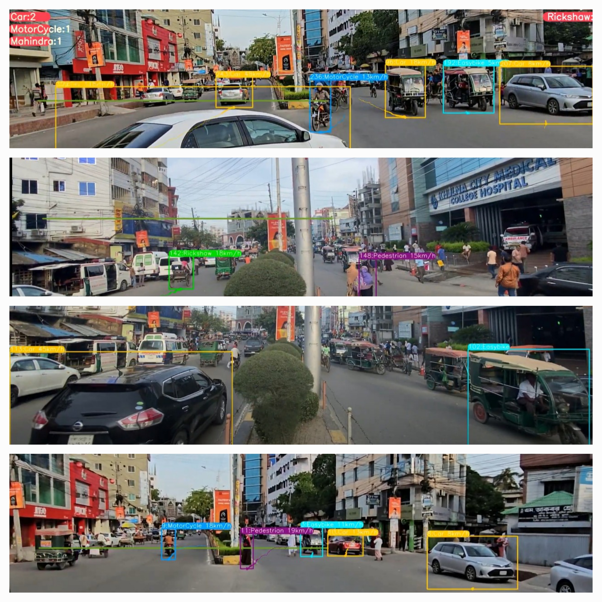
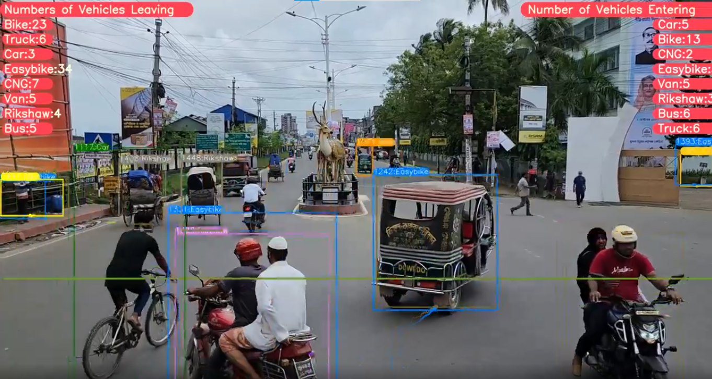

cat > README.md << 'EOF'
# YOLOv8 Object Detection with DeepSORT Tracking (ID + Trails)

  

## 🚀 One-Click Google Colab Demos

Run object detection and tracking in your browser using Google Colab (GPU runtime recommended):

- 📦 **YOLOv8 Object Detection + DeepSORT Tracking (ID + Trails)**  
  [Open in Google Colab](https://colab.research.google.com/drive/1U6cnTQ0JwCg4kdHxYSl2NAhU4wK18oAu?usp=sharing)

- 📦 **YOLOv8 Detection & Tracking on Custom Data**  
  [Open in Google Colab](https://colab.research.google.com/drive/1dEpI2k3m1i0vbvB4bNqPRQUO0gSBTz25?usp=sharing)

## 📂 Project Repository

[GitHub Repo - Vehicle Detection Thesis](https://github.com/niloybiswas190448/Vehicle_Detection_thesis)

---

## 🧰 Steps to Run Locally

### 1️⃣ Clone the repository
\`\`\`bash
git clone https://github.com/niloybiswas190448/Vehicle_Detection_thesis.git
cd Vehicle_Detection_thesis
\`\`\`

### 2️⃣ Install dependencies
\`\`\`bash
pip install -e '.[dev]'
\`\`\`

### 3️⃣ Navigate to the detection module
\`\`\`bash
cd ultralytics/yolo/v8/detect
\`\`\`

### 4️⃣ Download DeepSORT integration  
- 📥 [Download DeepSORT Files](https://drive.google.com/drive/folders/1kna8eWGrSfzaR6DtNJ8_GchGgPMv3VC8?usp=sharing) from Google Drive  
- Unzip it  
- Move the \`deep_sort_pytorch\` folder into \`ultralytics/yolo/v8/detect/\`

### 5️⃣ Download a sample video
\`\`\`bash
gdown "https://drive.google.com/uc?id=1rjBn8Fl1E_9d0EMVtL24S9aNQOJAveR5&confirm=t"
\`\`\`

### 6️⃣ Run the model

#### ➤ YOLOv8 Detection + DeepSORT Tracking
\`\`\`bash
python predict.py model=yolov8l.pt source="test3.mp4" show=True
\`\`\`

#### ➤ YOLOv8 Detection + Tracking + Vehicle Counting
- 🔁 [Download updated \`predict.py\`](https://drive.google.com/drive/folders/1awlzTGHBBAn_2pKCkLFADMd1EN_rJETW?usp=sharing)  
- Replace the existing one inside \`ultralytics/yolo/v8/detect/\`
\`\`\`bash
python predict.py model=yolov8l.pt source="test3.mp4" show=True
\`\`\`

---

## 📊 Results

### ✅ Vehicle Detection, Tracking, and Counting Example

  
  

---

## 🔗 Related Post

See the full post on [LinkedIn](https://www.linkedin.com/feed/update/urn:li:activity:7201622636068564992/)

---

## 👨‍💻 Author

**Niloy Biswas**  
Urban Planner | Deep Learning Enthusiast | Transportation Researcher  

📧 Email: [niloyurp48@gmail.com](mailto:niloyurp48@gmail.com)  
🔗 [LinkedIn](https://www.linkedin.com/in/niloy-biswas-92003b1b3)  
📚 [ResearchGate](https://www.researchgate.net/profile/Niloy-Biswas-2?ev=hdr_xprf)

> *Empowering smart cities through deep learning and urban data science.*
EOF
